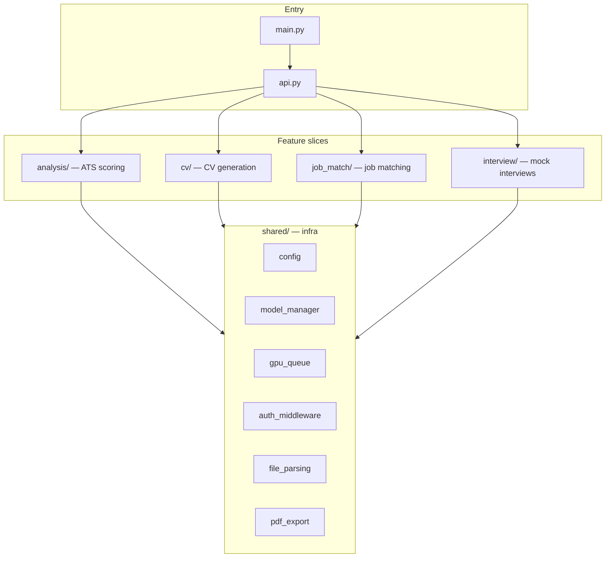

# CV Agent — Architecture Reference

Complete guide to every file in `ai-models`: what it does, how slices connect, and how data flows end-to-end.

**Server:** FastAPI on port 8000  
**Entry point:** `main.py` → `cv_agent.app.api:app`

**v9 layout:** `cv_agent/app/` is the FastAPI shell only. Engine packages live at the repo root:

| Package | API prefix | Role |
|---------|------------|------|
| `analysis/` | `POST /cv-analysis/analyze`, `GET /cv-analysis/analyze/{job_id}` | CV analysis (Modal fine-tuned endpoint) |
| `cv_generator/` | `/generate`, `/generate-ai-cv`, `/status`, `/result` | CV generation (Gemini) |
| `job_matcher/` | `/jobs/match`, `/jobs/results/{id}` | Job matching |
| `interview/` | `/interview/*` | Mock interviews |

Legacy `cv_agent/cv`, `cv_agent/analysis`, `cv_agent/job_match`, and `cv_agent/interview` have been removed.

**v8 layout (deprecated):** Feature-isolated folders under `cv_agent/` — `cv/`, `analysis/`, `job_match/`, `interview/`.

---

## Table of contents

1. [High-level overview](#high-level-overview)
2. [Request flow](#request-flow)
3. [Root-level files](#root-level-files)
4. [Package root (`cv_agent/`)](#package-root-cv_agent)
5. [Shared infrastructure (`cv_agent/shared/`)](#shared-infrastructure-cv_agentshared)
6. [CV Analysis (`cv_agent/analysis/`)](#cv-analysis-cv_agentanalysis)
7. [CV Generation (`cv_agent/cv/`)](#cv-generation-cv_agentcv)
8. [Job Matching (`cv_agent/job_match/`)](#job-matching-cv_agentjob_match)
9. [Virtual Interview (`cv_agent/interview/`)](#virtual-interview-cv_agentinterview)
10. [Scripts (`scripts/`)](#scripts-scripts)
11. [Tests (`tests/`)](#tests-tests)
12. [Notebooks (`notebooks/`)](#notebooks-notebooks)
13. [Frontend integration](#frontend-integration)
14. [Environment variables](#environment-variables)

---

## High-level overview

`ai-models` is organized as **vertical slices** (one per product feature) plus **shared infrastructure** (models, GPU, auth, parsing).



| Slice | Endpoints | Purpose |
|-------|-----------|---------|
| `analysis/` | `POST /cv-analysis/analyze`, `GET /cv-analysis/analyze/{job_id}` | Async CV analysis (parse → Modal → validate) |
| `cv_generator/` | `POST /generate`, `/generate-ai-cv`, `GET /status`, `/result` | Generate and refine a CV |
| `job_matcher/` | `POST /jobs/match`, `GET /jobs/results/{id}` | Match CV to curated job listings |
| `interview/` | `POST /interview/start`, `/answer`, `/evaluate` | Virtual interview Q&A |

**Models used:**

| Role | Model |
|------|-------|
| CV Writer | `mistralai/Mistral-7B-Instruct-v0.3` |
| ATS Judge | `OsamaHayba/qwen-ats-merged-stage1` + LoRA adapter |
| HR Judge | `Qwen/Qwen2.5-7B-Instruct` |
| Embeddings (RAG) | `sentence-transformers/all-MiniLM-L6-v2` |

---

## Request flow

```
Browser (React, port 5173)
    │  Authorization: Bearer <JWT>
    ▼
cv_agent.api (port 8000)
    ├── JWT middleware (shared/auth_middleware.py)
    ├── Rate limiting (api.py)
    └── Feature router
            ├── analysis/router.py  → analysis/pipeline.py
            ├── cv/router.py        → cv/pipeline.py (background thread)
            ├── job_match/router.py → job_match/service.py
            └── interview/router.py → interview/service.py
```

All LLM inference is serialized through `shared/gpu_queue.py` → `shared/model_manager.py`.

---

## Root-level files

| File | Role |
|------|------|
| `main.py` | Server entry point — loads `.env`, starts Uvicorn (`python3 main.py`) |
| `requirements.txt` | Python dependencies (FastAPI, LangGraph, transformers, ReportLab, etc.) |
| `env.template` | Environment variable template (`HUGGINGFACE_TOKEN`, model names, auth, CORS, etc.) |
| `.gitignore` | Ignores venv, downloaded models, `.env`, caches |
| `README.md` | Setup guide, API examples, quick-start commands |
| `ARCHITECTURE.md` | This file — full architecture reference |

---

## Package root (`cv_agent/`)

| File | Role |
|------|------|
| `__init__.py` | Public API — re-exports `run_pipeline`, `UserProfile`, `app`, judges, cache, etc. for library use |
| `api.py` | **FastAPI app factory** — CORS, rate limiting, request timing, `/health`, `/cache`; registers all four feature routers; warms writer model on startup |
| `cli.py` | CLI entry: `cv_agent run` (generate CV from terminal JSON/flags) and `cv_agent serve` (start server) |

### Root shims (backward compatibility)

These are thin re-exports so older `from cv_agent.X import Y` imports still work:

| Shim file | Re-exports from |
|-----------|-----------------|
| `config.py` | `shared/config.py` |
| `schemas.py` | `shared/schemas.py` |
| `cache.py` | `shared/cache.py` |
| `gpu_queue.py` | `shared/gpu_queue.py` |
| `model_manager.py` | `shared/model_manager.py` |
| `hallucination_guard.py` | `shared/hallucination_guard.py` |
| `file_parsing.py` | `shared/file_parsing.py` |
| `pdf_export.py` | `shared/pdf_export.py` |
| `memory.py` | `shared/memory.py` |
| `routing.py` | `shared/routing.py` |
| `prompts.py` | `shared/prompts.py` |
| `utils.py` | `shared/utils.py` |
| `rag.py` | `analysis/rag.py` |
| `pipeline.py` | `cv/pipeline.py` |
| `auth_middleware.py` | `shared/auth_middleware.py` |

---

## Shared infrastructure (`cv_agent/shared/`)

Used by all feature slices. Safe to import from any module.

| File | Role |
|------|------|
| `config.py` | `PipelineConfig` dataclass, env var loading, structured logging, optional-dependency flags (`_FAISS_AVAILABLE`, `_REPORTLAB_AVAILABLE`, etc.). **Leaf module** — no intra-package imports (avoids circular deps). |
| `schemas.py` | Core Pydantic models: `UserProfile`, `JudgeOutput`, `EnsembleResult`, `JDContext`, `GuardResult`, `LoopDecision`, `IterationRecord`, `CVAgentState`, `PipelineResult` |
| `model_manager.py` | Singleton HuggingFace model loader — writer, ATS judge (base + LoRA), HR judge; all inference routed through GPU queue |
| `gpu_queue.py` | Single-threaded GPU worker queue — thread-safe serialization of all model calls; auto-restart on worker crash |
| `cache.py` | Thread-safe LRU cache for LLM responses (keyed by profile + JD hash) |
| `hallucination_guard.py` | Validates generated CV text against user profile — detects invented employers, skills, dates; supports ontology JSON/YAML |
| `file_parsing.py` | Extract plain text from uploaded PDF, DOCX, or TXT resumes |
| `pdf_export.py` | Convert Markdown CV → downloadable PDF via ReportLab |
| `memory.py` | SQLite-backed session store — records iteration history and pattern injection for cross-session learning |
| `routing.py` | LangGraph loop controller — generates N writer candidates, runs ensemble judges, selects best, decides revise/stop (`adaptive_decide`) |
| `prompts.py` | System prompts for CV writer and ATS/HR judge models |
| `auth_middleware.py` | JWT verification middleware (same `JWT_SECRET` as backend); dev bypass via `CV_AGENT_AUTH_DISABLED=true` |
| `utils.py` | Shared helpers: safe JSON parse, `jd_hash`, `normalise`, `@timed_node` decorator |

---

## CV Analysis (`analysis/`)

**Purpose:** Score an uploaded CV via a fine-tuned Modal endpoint.  
**Frontend route:** `/dashboard/analyzer` → `src/features/cv-analysis/`

| Folder | Role |
|--------|------|
| `api/` | FastAPI routes (`/cv-analysis/*`), session store, pipeline orchestration |
| `parsing/` | PDF/DOCX/TXT → plain text (`parse_resume_bytes`) — shared with `job_matcher` |
| `model_client/` | `urllib` HTTP client to `MODAL_ENDPOINT_URL` |
| `validation/` | `AnalysisResult` schema + defensive JSON coercion |
| `cv_reader/` | Thin delegate to `parsing/` + optional identity extraction |

### Analysis data flow

```
POST /cv-analysis/analyze (multipart file)
    → parsing/file_parsing.parse_resume_bytes()
    → background thread: model_client.call_analysis_model()
    → validation/validate_result()
    → GET /cv-analysis/analyze/{job_id} polls until ready
    → { "ats", "hr" } wrapper for frontend mapper
```

---

## CV Generation (`cv_agent/cv/`)

**Purpose:** Generate a new CV from user profile data, iteratively refining until quality threshold is met.  
**Frontend route:** `/dashboard/editor/*` → `src/features/cv-editor/`

### LangGraph loop

```
POST /generate
    → cv/router.py creates session, starts background thread
    → cv/pipeline.run_pipeline()
         writer_node  → generate N candidate CVs (shared/routing.generate_candidates)
         judge_node   → ensemble judges score candidates (analysis/llm_analysis)
         router_node  → adaptive_decide: revise or stop (shared/routing)
              ↑______________________________|
              (loop until score ≥ threshold or max iterations)
    → GET /status/{id}   poll progress
    → GET /result/{id}   final Markdown + scores
    → GET /result/{id}/pdf  shared/pdf_export
```

| File | Role |
|------|------|
| `router.py` | API routes: `POST /generate`, `GET /status/{session_id}`, `GET /result/{session_id}`, `GET /result/{session_id}/pdf`, `GET /sessions` |
| `pipeline.py` | LangGraph graph builder (`build_graph`) and runner (`run_pipeline`); nodes: `writer_node`, `judge_node`, `router_node` |
| `session.py` | `SessionManager` — in-memory tracking of async pipeline runs (`pending` → `running` → `completed` / `failed`) |
| `schemas.py` | `GenerateRequest`, `GenerateResponse`, `StatusResponse`, `ResultResponse` |
| `template.py` | Fallback template CV generator when LLM pipeline is unavailable |
| `speed.py` | CPU/fast-mode tuning — reduces iterations and candidates on CPU or when `CV_FAST_MODE=true` |
| `__init__.py` | Package marker |

---

## Job Matching (`cv_agent/job_match/`)

**Purpose:** Score a CV against curated job listings.  
**Frontend route:** `/dashboard/jobs` → `src/features/job-agent/`

| File | Role |
|------|------|
| `router.py` | `POST /jobs/match` (start match), `GET /jobs/results/{session_id}` (fetch results) |
| `service.py` | `run_job_match()` — fetches jobs, scores via RAG keyword overlap, ranks by fit score |
| `job_fetcher.py` | `fetch_jobs()` — curated sample job listings (placeholder for external job APIs) |
| `session.py` | In-memory `MatchSession` store |
| `schemas.py` | `JobListing`, `MatchedJob`, `MatchRequest`, `MatchResponse`, `MatchResultsResponse` |
| `__init__.py` | Package marker |

---

## Virtual Interview (`cv_agent/interview/`)

**Purpose:** Mock interview — generate questions from CV, score answers, produce final evaluation.  
**Frontend route:** `/dashboard/interview` → `src/features/interview/`

| File | Role |
|------|------|
| `router.py` | `POST /interview/start`, `POST /interview/answer`, `POST /interview/evaluate`, `GET /interview/{session_id}` |
| `service.py` | `start_interview()`, `submit_answer()`, `evaluate_interview()`, `get_session()` |
| `evaluator.py` | `generate_questions()` from CV text; `score_answer()` per question; `evaluate_session()` final summary |
| `session.py` | In-memory `InterviewRecord` store (questions, answers, scores) |
| `schemas.py` | `StartInterviewRequest`, `InterviewQuestion`, `AnswerScore`, `EvaluationResult`, `SubmitAnswerRequest/Response` |
| `__init__.py` | Package marker |

---

## Scripts (`scripts/`)

| File | Role |
|------|------|
| `setup.sh` | One-time: create `.venv` and `pip install -r requirements.txt` |
| `stop.sh` | Stop processes on port 8000 |
| `download_models.py` | Pre-download all HuggingFace models (~20 GB, run once) |

---

## Tests (`tests/`)

| File | What it tests |
|------|---------------|
| `conftest.py` | Shared pytest fixtures |
| `test_analysis_heuristic.py` | Heuristic analysis checks (no LLM) |
| `test_feature_engine.py` | `CvFacts` extraction |
| `test_keyword_engine.py` | Keyword coverage matching |
| `test_llm_issues.py` | LLM issue generation output |
| `test_text_pipeline.py` | Section parsing and text normalization |
| `test_scoring_calibration.py` | Score calibration across modes |
| `test_routing.py` | LangGraph adaptive routing decisions |
| `test_schemas.py` | Pydantic schema validation |
| `test_cache.py` | LRU cache hit/miss/eviction |
| `test_hallucination_guard.py` | Hallucination detection against profile |
| `test_interview.py` | Interview start/answer/evaluate flow |
| `test_job_match.py` | Job matching scoring |
| `test_full_stack_sample_pdf.py` | End-to-end CV generation → PDF export |

Run all tests:

```bash
pytest tests/ -v
```

---

## Notebooks (`notebooks/`)

| File | Role |
|------|------|
| `README.md` | Notes on reference notebooks (e.g. Osama ATS analysis experiments); production code lives in `cv_agent/analysis/` |

---

## Frontend integration

From the monorepo root (`front-end-`):

| Frontend slice | Path | Backend slice | Key endpoints |
|----------------|------|---------------|---------------|
| `cv-analysis` | `src/features/cv-analysis/` | `analysis/` | `/analyze`, `/analyze/upload`, `/analyze/parse` |
| `cv-editor` | `src/features/cv-editor/` | `cv/` | `/generate`, `/status`, `/result`, `/pdf` |
| `job-agent` | `src/features/job-agent/` | `job_match/` | `/jobs/match`, `/jobs/results/{id}` |
| `interview` | `src/features/interview/` | `interview/` | `/interview/start`, `/answer`, `/evaluate` |
| `auth` | `src/features/auth/` | `backend/` (port 5000) | `/login`, `/register` |

**Shared frontend HTTP client:** `src/shared/lib/cv-agent-client.ts` — JWT-authenticated fetch to `VITE_CV_AGENT_URL` (default `http://localhost:8000`).

### Authentication flow

Node.js `backend/` (port 5000) is the **only** authentication service — register, login, OAuth, and JWT issuance.

1. User authenticates via `backend/` → receives JWT
2. Frontend stores token in `useAuthStore` and validates via `GET /api/auth/me`
3. All CV Agent requests include `Authorization: Bearer <token>`
4. `cv_agent/app/auth.py` verifies backend-issued JWT (same `JWT_SECRET`) — no login on Python
5. Isolated API testing only: `CV_AGENT_AUTH_DISABLED=true` in `ai-models/.env`

### Local development (3 terminals)

```bash
# Terminal 1 — frontend
cd frontend && npm run dev

# Terminal 2 — backend
cd backend && npm run dev

# Terminal 3 — AI models
cd ai-models && source .venv/bin/activate && python3 main.py
```

---

## Environment variables

| Variable | Default | Description |
|----------|---------|-------------|
| `HUGGINGFACE_TOKEN` | — | Required to download models |
| `JWT_SECRET` | — | Must match `backend/.env` |
| `CV_AGENT_AUTH_DISABLED` | `false` | Skip JWT check (pytest / isolated API tests only) |
| `WRITER_MODEL` | `mistralai/Mistral-7B-Instruct-v0.3` | CV writer model |
| `JUDGE_BASE_MODEL` | `OsamaHayba/qwen-ats-merged-stage1` | ATS judge base |
| `JUDGE_ADAPTER_PATH` | `OsamaHayba/cv-analysis-final-stage2` | ATS judge LoRA adapter |
| `HR_JUDGE_MODEL` | `Qwen/Qwen2.5-7B-Instruct` | HR judge model |
| `DEVICE` | `auto` | `auto`, `cuda`, `mps`, `cpu` |
| `LOAD_IN_4BIT` | `true` | 4-bit quantization (GPU only) |
| `MAX_ITERATIONS` | `5` | Max LangGraph iterations per CV generation |
| `SCORE_THRESHOLD` | `82` | Target quality score (0–100) |
| `ANALYSIS_USE_MISTRAL_JUDGE` | `false` | Use Mistral instead of Qwen for analysis |
| `ANALYSIS_ENSEMBLE_TIMEOUT_S` | `0` | Analysis timeout (0 = no limit) |
| `ALLOWED_ORIGINS` | `http://localhost:3000,...` | CORS allowed origins |
| `RATE_LIMIT_RPM` | `20` | Max requests per minute per IP |
| `PIPELINE_WORKERS` | `2` | Concurrent background pipeline threads |
| `CV_WARMUP_MODEL` | `true` | Pre-load writer model on startup |
| `CV_FAST_MODE` | `false` | Reduce work on CPU / fast generation |
| `HOST` | `0.0.0.0` | Server bind host |
| `PORT` | `8000` | Server port |
| `RELOAD` | `true` | Uvicorn auto-reload (dev only) |

Copy and configure:

```bash
cp env.template .env
# Edit HUGGINGFACE_TOKEN, JWT_SECRET, etc.
```

Or sync from monorepo root:

```bash
Copy `ai-models/env.template` to `ai-models/.env` — no root env sync.
```

---

## Mental model

1. **`api.py`** is the hub — middleware, health, cache, route registration.
2. **`shared/`** is the engine room — models, GPU queue, auth, parsing, PDF, prompts.
3. **Each feature folder** has `router.py` (HTTP), `schemas.py` (types), and business logic.
4. **Root-level shims** (`pipeline.py`, `config.py`, etc.) exist only for backward-compatible imports.
5. **`analysis/`** scores existing CVs (9 layers); **`cv/`** generates new CVs (LangGraph loop).
6. **`job_match/`** and **`interview/`** are lighter features built on the same shared infra.
7. All GPU work goes through **`gpu_queue.py`** — never call model pipelines directly from request handlers.
