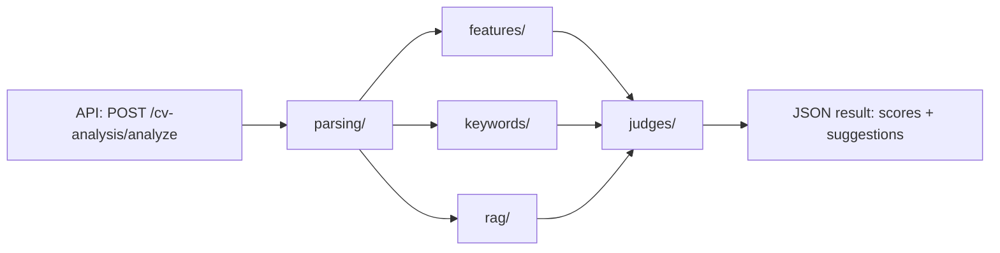

# CV Analysis (`cv_analysis`)

Resume scoring engine inside `ai-models`. It accepts a CV (file upload or plain text), optionally a job description, runs it through parsing → feature extraction → keyword/JD matching → LLM judges, and returns ATS/HR scores plus improvement suggestions.

Mounted on the main FastAPI app via `register_cv_analysis_routes()` in `cv_agent/app/api.py`.

## End-to-end flow



**Async job stages** (polled via `GET /cv-analysis/analyze/{job_id}`):

| Stage | What happens |
|-------|----------------|
| `parsing` | Extract text, split into sections |
| `features` | Count bullets, metrics, skills, etc. |
| `judging` | LLM scores ATS + HR perspectives |
| `done` | Result ready |

## Folder map

| Folder | Role |
|--------|------|
| `api/` | REST interface + async job polling |
| `parsing/` | Read the resume (PDF/DOCX/TXT → structured markdown) |
| `features/` | Count and measure what's in the CV (no LLM) |
| `rag/` + `keywords/` | Understand the job description and match keywords |
| `judges/` | Score the CV like ATS + HR would (local GGUF via `llama-server`) |
| `pipeline.py` | Orchestrates the full assembly line |
| `config.py` | Settings from `.env` (`CV_ANALYSIS_*` prefix) |

## Root files

| File | Role |
|------|------|
| `__init__.py` | Package marker |
| `config.py` | All `CV_ANALYSIS_*` settings from `.env`: GGUF model path, `llama-server` URL/port, judge weights, cache size, mock mode |
| `pipeline.py` | **Orchestrator** — `prepare_cv_from_bytes()`, `prepare_cv_from_text()`, `run_analysis_pipeline()`; wires every layer together and returns the final result dict |

## `api/` — HTTP layer

Handles async jobs: start analysis, poll status.

| File | Role |
|------|------|
| `router.py` | Registers `POST /cv-analysis/analyze` (file upload or `cv_text` + optional `jd_text`) and `GET /cv-analysis/analyze/{job_id}` |
| `service.py` | Starts background threads that call `run_analysis_pipeline()` and update job state |
| `session.py` | In-memory job store (`AnalysisJobStore`) — job ID, status (`processing` / `ready` / `failed`), stage, result, TTL cleanup |
| `schemas.py` | Pydantic response types: `AnalysisStartResponse`, `AnalysisJobResponse` |
| `__init__.py` | Package marker |

## `parsing/` — CV text extraction and structure

Turns PDF/DOCX/TXT into clean, sectioned markdown.

| File | Role |
|------|------|
| `file_parsing.py` | Reads **PDF** (pdfplumber), **DOCX**, **TXT** from bytes; picks the best extraction when multiple strategies exist |
| `normalization.py` | Cleans PDF noise (ligatures, page markers, hyphenation), normalizes whitespace |
| `text_pipeline.py` | Detects section headings (Experience, Skills, etc.), slices content, builds structured markdown |
| `structured_cv.py` | Produces a `StructuredCv` object: sections, contact info, target role, raw markdown |
| `__init__.py` | Package marker |

**Layer order:** raw bytes → normalized text → sectioned markdown → `StructuredCv`

## `features/` — Deterministic CV facts (no LLM)

Rule-based signals fed into judges and the API response.

| File | Role |
|------|------|
| `feature_engine.py` | Builds `CvFacts`: bullet count, metrics, contact/links, skill specificity, vague phrases, section completeness |
| `ats_signals.py` | ATS-focused checklist text (format issues, keyword placement, experience structure) for the ATS judge prompt |
| `cv_inventory.py` | Human-readable **inventory** of what was found (roles, skills, metrics, sections) — used to stop the LLM from hallucinating “missing” items |
| `__init__.py` | Package marker |

## `keywords/` — JD keyword matching

| File | Role |
|------|------|
| `keyword_engine.py` | Compares CV text vs JD keywords/requirements; returns coverage % and `missing_keywords` list |
| `__init__.py` | Package marker |

Uses `JDContext` from the RAG module as input.

## `rag/` — Job description understanding

| File | Role |
|------|------|
| `jd_extraction.py` | `RAGModule` — extracts keywords, requirements, and canonical skills from a job description; optional FAISS + sentence-transformers semantic search; regex/TF-IDF fallback |
| `__init__.py` | Package marker |

When no JD is provided, it falls back to profile/CV context for keyword extraction.

## `judges/` — LLM scoring

Runs the fine-tuned **cv-analysis GGUF** model via local `llama-server`.

| File | Role |
|------|------|
| `model_runtime.py` | Starts/stops `llama-server`, HTTP client (`LlamaCppClient`), mock client for tests, warmup |
| `llm_analysis.py` | **Main judge logic** — builds prompts, calls combined ATS+HR judge, caches results |
| `prompts.py` | System/user prompt templates, scoring rubric, verification rules (“don’t claim missing what exists”) |
| `schemas.py` | Data models: `JudgeOutput`, `EnsembleResult`, `StructuredCv`, `CvFacts`, `JDContext`, `KeywordMatchResult`, etc. |
| `issue_cleanup.py` | Lightweight cleanup — drops rewrites already in the CV, dedupes issues (not full validation) |
| `cache.py` | Thread-safe LRU cache for judge results (keyed by CV + JD hash) |
| `queue.py` | Single-slot `ModelQueue` so only one inference runs at a time on CPU |
| `utils.py` | `parse_json_robust()` (handles truncated/broken LLM JSON), `jd_hash()`, timing helpers |
| `__init__.py` | Package marker |

**Judge flow in `llm_analysis.py`:**

1. Build prompt from inventory + facts + JD + ATS signals
2. Submit to `llama-server` via `inference_queue`
3. Parse JSON → `JudgeOutput` for ATS and HR
4. `issue_cleanup` prunes duplicate fixes and rewrites already present in the CV
5. Return `{ "ats", "hr" }` to the client

## API result shape

Job `result` is always:

```json
{
  "ats": { "overall_score": 75, "strengths": [], "weaknesses": [], ... },
  "hr": { "overall_score": 76, "strengths": [], "weaknesses": [], ... }
}
```

No `cv_inventory`, `ats_signals`, `keyword_coverage`, or `blended` in the response — those are prompt-only or removed.

## How folders connect

```
api/          → HTTP + async jobs
    ↓
pipeline.py   → coordinates everything
    ↓
parsing/      → StructuredCv
features/     → CvFacts, inventory, ATS signals
rag/          → JDContext (keywords, requirements)
keywords/     → KeywordMatchResult
    ↓
judges/       → EnsembleResult (ATS + HR model outputs)
```

## Configuration

Behavior is controlled via `ai-models/.env` with the `CV_ANALYSIS_` prefix. Examples:

| Variable | Purpose |
|----------|---------|
| `CV_ANALYSIS_MODEL_FILE` | GGUF model filename |
| `CV_ANALYSIS_LLAMA_SERVER_URL` | `llama-server` base URL (default `http://127.0.0.1:8080`) |
| `CV_ANALYSIS_MOCK_INFERENCE` | Skip real LLM in tests (`true` / `false`) |

See `config.py` for the full list of settings and defaults.
