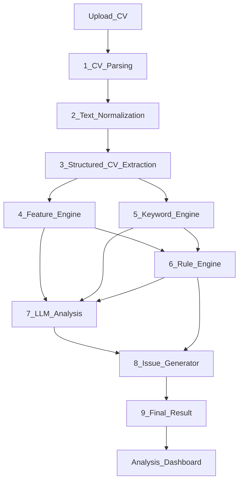

# CV Analysis — Full Documentation

How the **Analysis** feature works end-to-end: from file upload in the React app to ATS scoring on the CV Agent backend.

---

## Table of contents

1. [Overview](#overview)
2. [Architecture diagram](#architecture-diagram)
3. [User flows](#user-flows)
4. [API endpoints](#api-endpoints)
5. [Backend pipeline (step by step)](#backend-pipeline-step-by-step)
6. [Scoring modes](#scoring-modes)
7. [Backend files (`ai-models/cv_agent/analysis/`)](#backend-files)
8. [Shared backend dependencies](#shared-backend-dependencies)
9. [Frontend files (`src/features/cv-analysis/`)](#frontend-files)
10. [Configuration & environment](#configuration--environment)
11. [Tests](#tests)
12. [Common pitfalls](#common-pitfalls)

---

## Overview

| Layer | Location | Role |
|-------|----------|------|
| **UI** | `src/features/cv-analysis/` | Upload CV, show scores, issues, keyword coverage |
| **HTTP client** | `src/shared/lib/cv-agent-client.ts` | JWT auth, timeouts, `fetch` to port 8000 |
| **API routes** | `cv_agent/analysis/router.py` | `POST /analyze`, `/analyze/upload`, `/analyze/parse` |
| **Text pipeline** | `cv_agent/analysis/pipeline.py` + layer modules | 9-layer orchestrator: parse → normalize → structure → features → keywords → rules → LLM → issues |
| **Scoring** | `rule_engine.py`, `llm_analysis.py` | Heuristic or LLM ensemble judges (facts-driven prompts) |
| **JD context** | `cv_agent/analysis/rag.py` | Keywords from job description / profile context |

**Route in app:** `/dashboard/analyzer` → `AnalysisPage`

**Backend base URL:** `VITE_CV_AGENT_URL` (default `http://localhost:8000`)

---

## Architecture diagram

Nine-layer pipeline (aligned with `CV_Analysis_Architecture.docx`):



End-to-end stack:

```
┌─────────────────────────────────────────────────────────────────────────────┐
│  Browser — AnalysisPage (/dashboard/analyzer)                               │
│  Upload / editor draft → POST /analyze/upload → dashboard (Overall/ATS/HR)  │
└───────────────────────────────┬─────────────────────────────────────────────┘
                                ▼
┌─────────────────────────────────────────────────────────────────────────────┐
│  CV Agent — pipeline.run_analysis_pipeline()                                │
│  1 shared/file_parsing → parse_resume_bytes()                               │
│  2 normalization.py    → normalize_raw_text(), normalize_pdf_artifacts()    │
│  3 structured_cv.py    → StructuredCv (sections, header, target_role)       │
│  4 feature_engine.py   → CvFacts (word/bullet/metric counts)                │
│  5 keyword_engine.py   → KeywordMatchResult (coverage + missing_keywords)     │
│  6 rule_engine.py      → RuleEngine.evaluate(facts, structured)             │
│  7 llm_analysis.py     → ATS + HR judges (facts-driven prompts, GPU)        │
│  8 issue_generator.py  → AnalysisIssue cards with evidence                  │
│  9 schemas.AnalysisResult → ats_score, hr_score, extraction metadata        │
└─────────────────────────────────────────────────────────────────────────────┘
```

See also [ARCHITECTURE.md](./ARCHITECTURE.md) for the full monorepo layout.

---

## User flows

### A. Upload a PDF/DOCX/TXT on Analysis page

1. User picks a file → `attachCvFile()` in `analysis-page.tsx`
2. **Pre-fill (optional):** `resolveAnalysisContextFromFile()`  
   - `.txt` / `.md`: client-side `extract-cv-context.ts`  
   - PDF/DOCX: `POST /analyze/parse` on backend
3. User clicks **Run analysis** → `POST /analyze/upload` with multipart form:
   - `file`, `target_role`, `company`, `job_description`
4. Backend extracts text, structures sections, auto-fills empty fields from CV, runs judges
5. UI shows scores, verdict, issues, keyword coverage; caches result in `sessionStorage`

### B. Open Analysis from CV editor

1. Editor calls `navigate("/dashboard/analyzer", { state: { cvText, autoRun? } })`  
   or `{ autoUpload: true }` with `setPendingAnalysisFile(file)`
2. Analysis page mounts → loads editor draft via `getDraftAnalysisFile()` or consumes `location.state`
3. Same upload/score path as above

### C. Home page “Analyze my CV”

1. Auth-gated navigate to `/dashboard/analyzer` with `autoUpload: true`
2. User selects file on template picker or analysis page

---

## API endpoints

### `POST /analyze`

Score CV text already in the request body (no file upload).

**Request (JSON):**

```json
{
  "cv_text": "# Name\n\n## Professional Summary\n...",
  "job_description": "Optional profile context or job posting text",
  "target_role": "Full Stack Developer",
  "company": ""
}
```

**Response:** `AnalysisResult` (see [schemas.py](../ai-models/cv_agent/analysis/schemas.py))

---

### `POST /analyze/upload`

Upload a file and analyze in one step. **Primary path used by the UI.**

**Request (multipart/form-data):**

| Field | Type | Description |
|-------|------|-------------|
| `file` | File | `.pdf`, `.docx`, `.txt` |
| `target_role` | string | Target role (auto-filled from CV if empty) |
| `company` | string | Latest employer (auto-filled if empty) |
| `job_description` | string | Profile context / summary+skills (auto-filled if empty) |

---

### `POST /analyze/parse`

Parse file only — no scoring. Used to pre-fill form fields before “Run analysis”.

**Response (`CvParseResult`):**

```json
{
  "target_role": "Full Stack Developer",
  "company": "Tech Corp",
  "job_description": "Summary + skills text…",
  "cv_text_length": 271,
  "extraction_word_count": 271,
  "sections_detected": ["summary", "skills", "experience", "projects", "education"],
  "bullet_count": 12
}
```

**Response (`AnalysisResult`)** — key fields added in the 9-layer rollout:

| Field | Description |
|-------|-------------|
| `overall_score` | Weighted composite |
| `ats_score` | ATS judge (or rule proxy in heuristic mode) |
| `hr_score` | HR judge (or rule proxy in heuristic mode) |
| `extraction_word_count` | Words in extracted markdown (`CvFacts.word_count`) |
| `sections_detected` | Canonical sections found in structured CV |
| `missing_keywords` | JD terms not present in CV text |
| `issues[].evidence` | Fact snapshot backing each issue (e.g. `word_count=271, bullets=12`) |

---

## Backend pipeline (9 layers)

All routes delegate to **`pipeline.run_analysis_pipeline()`** (or `parse_cv_file()` for parse-only).

| Layer | Module | Purpose |
|-------|--------|---------|
| **1 — Parsing** | `shared/file_parsing.py` | PDF/DOCX/TXT bytes → raw text |
| **2 — Normalization** | `normalization.py` | `(cid:127)` → `•`, whitespace, de-hyphenation |
| **3 — Structured CV** | `structured_cv.py` | `StructuredCv` model: header, sections, target_role, links |
| **4 — Feature engine** | `feature_engine.py` | `CvFacts`: word/bullet/metric/skill counts (single source of truth) |
| **5 — Keyword engine** | `keyword_engine.py` | `KeywordMatchResult`: coverage rows + `missing_keywords` |
| **6 — Rule engine** | `rule_engine.py` | `RuleEngine` — deterministic checks using `CvFacts`, not re-parsing |
| **7 — LLM analysis** | `llm_analysis.py` | Facts-driven ATS/HR prompts (GPU ensemble) |
| **8 — Issue generator** | `issue_generator.py` | Weaknesses → `AnalysisIssue` with `evidence` |
| **9 — Final result** | `pipeline.py` + `schemas.py` | Assemble `AnalysisResult` for API + dashboard |

**Legacy:** `text_pipeline.py` still exports `structure_cv_text()`, `slice_section()`, `parse_cv_file_for_analysis()`.

### Layer 1 — File text extraction

**File:** `cv_agent/shared/file_parsing.py`

| Format | Method |
|--------|--------|
| **PDF** | pdfplumber word-rebuild (primary), pypdf, optional PyMuPDF; picks richest extraction |
| **DOCX** | python-docx paragraphs |
| **TXT** | UTF-8 decode |

### Layer 2 — Text normalization

**File:** `cv_agent/analysis/normalization.py`

| Function | Purpose |
|----------|---------|
| `normalize_pdf_artifacts()` | `(cid:127)` → `•`, soft hyphens |
| `normalize_raw_text()` | Line endings, whitespace, de-hyphenate line breaks |
| `is_structured_markdown()` | Skip re-structuring for editor markdown |

**Legacy:** `text_pipeline.py` still exports `structure_cv_text()`, `slice_section()`, `parse_cv_file_for_analysis()`.

**Important:** Word count for scoring is `CvFacts.word_count` on extracted markdown, not visual PDF length.

### Layer 3 — Structured CV extraction

**File:** `cv_agent/analysis/structured_cv.py`

Produces `StructuredCv` with canonical sections (`summary`, `skills`, `experience`, …), header contact/links, and inferred `target_role` / `company`.

### Layer 4 — Feature engine

**File:** `cv_agent/analysis/feature_engine.py` — `build_cv_facts(structured)` → `CvFacts`

### Layer 5 — Keyword engine

**File:** `cv_agent/analysis/keyword_engine.py` — `match_keywords(cv_text, jd_context)` → coverage + `missing_keywords`

JD keywords still extracted via **`rag.py`** (`RAGModule.extract()`).

### Layer 6 — Rule engine

**File:** `cv_agent/analysis/rule_engine.py` — class `RuleEngine` (alias `RuleJudge`)

Deterministic rules using `CvFacts`:

| Signal | Source |
|--------|--------|
| Sections | `facts.sections_present`, `facts.missing_sections` |
| Bullets / metrics | `facts.bullet_count`, `facts.metrics_count` |
| Word count | `facts.word_count` — compact complete CVs not flagged as “too brief” |
| Contact / links | `facts.has_contact`, `facts.has_links` |

**File:** `heuristic_checks.py` — `run_granular_checks()` for section-level detail.

### Layer 7 — LLM analysis (GPU)

**File:** `llm_analysis.py` — `run_llm_analysis()`, `run_ensemble()`

Prompts receive compact JSON **facts** + section summaries (not full raw PDF dump). **Default:** Qwen ATS + HR judges produce all scores, weaknesses, and recommendations. Heuristic fallback only when `ANALYSIS_HEURISTIC_ONLY=true` or `auto` and Qwen fails.

### Layer 8 — Issue generator

**File:** `issue_generator.py` — `generate_issues_from_llm()` passes Qwen weakness/recommendation pairs to the UI unchanged. `generate_issues()` (templates) is used only in heuristic dev mode.

---

## Backend pipeline (legacy reference)

The sections below describe behavior that is unchanged but now lives in the layer modules above.

---

## Scoring modes

Controlled by `ANALYSIS_HEURISTIC_ONLY` (`cv_agent/shared/config.py`). Default is **`false`** (Qwen ensemble).

| Mode | `analysis_mode` | When | Speed |
|------|-----------------|------|-------|
| **Heuristic** | `"heuristic"` | `ANALYSIS_HEURISTIC_ONLY=true` (dev/CI) | Seconds |
| **Ensemble** | `"ensemble"` | Default — Qwen ATS + HR judges on GPU | 1–2 min |

### Heuristic (`RuleEngine` + `heuristic_checks.py`)

**File:** `cv_agent/analysis/rule_engine.py` — class `RuleEngine` (alias `RuleJudge`)

Deterministic rules, no LLM:

| Signal | What it checks |
|--------|----------------|
| Sections | `experience`, `education`, `skills`, `summary` in text |
| Bullets | Lines starting with `-`, `•`, `(cid:N)` |
| Metrics | `%`, `$`, `Nx`, `N years` |
| Word count | Compact complete CVs (≥220 words, all sections) not flagged as “too brief” |
| Contact / links | Email, phone, LinkedIn, GitHub |
| Weak verbs | “worked on”, “helped with”, etc. |

**File:** `cv_agent/analysis/heuristic_checks.py` — `run_granular_checks()`

Section-level checks: summary length, experience bullets, projects, skills count, missing JD keywords, GitHub link for tech CVs.

### Ensemble (GPU)

**File:** `cv_agent/analysis/llm_analysis.py` — `run_llm_analysis()`, `run_ensemble()`

1. **ATS judge** — Qwen with `ATS_JUDGE_SYSTEM` prompt  
2. **HR judge** — Qwen with `HR_JUDGE_SYSTEM` prompt  
3. **Weighted blend** — `ats_weight` + `hr_weight` only (no rule judge)

Models: Osama ATS stack (default) or Mistral judge if `analysis_use_mistral_judge=true`.

On timeout or failure: returns an error by default. Heuristic fallback only when `ANALYSIS_HEURISTIC_ONLY=true` or `auto`.

---

## Backend files

| File | Responsibility |
|------|----------------|
| **`pipeline.py`** | Orchestrator: layers 1–9, `run_analysis_pipeline()`, `parse_cv_file()` |
| **`router.py`** | FastAPI routes: `/analyze`, `/analyze/upload`, `/analyze/parse` |
| **`service.py`** | Thin facade: `analyze_cv()` delegates to pipeline |
| **`normalization.py`** | Layer 2: PDF artifact + whitespace normalization |
| **`structured_cv.py`** | Layer 3: `StructuredCv` extraction + `extract_cv_metadata()` |
| **`feature_engine.py`** | Layer 4: `build_cv_facts()` → `CvFacts` |
| **`keyword_engine.py`** | Layer 5: `match_keywords()` → coverage + missing list |
| **`rule_engine.py`** | Layer 6: `RuleEngine` / `RuleJudge` |
| **`llm_analysis.py`** | Layer 7: facts-driven ATS/HR ensemble |
| **`issue_generator.py`** | Layer 8: `generate_issues()` with evidence |
| **`schemas.py`** | Pydantic models including extended `AnalysisResult` |
| **`text_pipeline.py`** | Legacy helpers: `structure_cv_text()`, `slice_section()` |
| **`heuristic_checks.py`** | Section-level granular rules |
| **`rag.py`** | `RAGModule` — JD keyword/requirement extraction |

### Related (outside `analysis/`)

| File | Role in analysis |
|------|------------------|
| `cv_agent/shared/file_parsing.py` | Raw PDF/DOCX/TXT bytes → string |
| `cv_agent/shared/config.py` | `PipelineConfig`, `ANALYSIS_HEURISTIC_ONLY`, timeouts |
| `cv_agent/shared/model_manager.py` | LLM pipes for ensemble judges |
| `cv_agent/shared/gpu_queue.py` | Serial GPU job queue |
| `cv_agent/shared/schemas.py` | `JudgeOutput`, `JDContext`, `EnsembleResult` |
| `cv_agent/api.py` | Registers `register_analysis_routes()` on app startup |
| `cv_agent/shared/auth_middleware.py` | JWT on all routes except `/health`, `/docs` |

---

## Frontend files

| File | Responsibility |
|------|----------------|
| **`components/analysis-page/analysis-page.tsx`** | Main UI: Overall/ATS/HR scores, extraction summary, missing keywords, issue evidence |
| **`lib/cv-analysis-api.ts`** | `analyzeCv()`, `analyzeCvUpload()`, `parseCvFile()`, session cache helpers. |
| **`lib/resolve-cv-context.ts`** | Merge file parse + editor draft → target role, company, profile context. |
| **`lib/extract-cv-context.ts`** | Client-side `.txt` extraction (mirrors backend heuristics). |
| **`lib/draft-for-analysis.ts`** | Editor draft → `.txt` `File` + inputs for analysis. |
| **`lib/pending-upload.ts`** | In-memory file handoff (home → analyzer before mount). |
| **`lib/abort-signal.ts`** | Timeout + abort for long-running analysis requests. |
| **`hooks/use-analyze-cv.ts`** | React Query mutations for `/analyze` and `/analyze/upload`. |
| **`types/analysis.types.ts`** | `CvAnalysisResult`, `AnalysisIssue`, navigation state types. |
| **`index.ts`** | Feature public exports. |

### Shared frontend

| File | Role |
|------|------|
| `src/shared/lib/cv-agent-client.ts` | Base URL, JWT header, `cvAgentFetch()` |
| `src/App.tsx` | Route `/dashboard/analyzer` → `AnalysisPage` |
| `src/features/cv-editor/...` | Navigate to analysis with draft or `autoUpload` |

---

## Configuration & environment

### Frontend (`.env.local`)

```env
VITE_CV_AGENT_URL=http://localhost:8000
```

Must match the port where `ai-models` is running.

### AI models (`ai-models/.env`)

| Variable | Effect on analysis |
|----------|-------------------|
| `CV_AGENT_AUTH_DISABLED=true` | Skip JWT (local dev) |
| `JWT_SECRET` | Must match `backend` for logged-in users |
| `ANALYSIS_HEURISTIC_ONLY=false` | Default — Qwen ATS + HR ensemble (all scores/issues from model) |
| `ANALYSIS_HEURISTIC_ONLY=true` | Dev/CI — rule-based scoring only |
| `ANALYSIS_HEURISTIC_ONLY=auto` | Qwen with heuristic fallback on timeout/failure |
| `ANALYSIS_ENSEMBLE_TIMEOUT_S` | Max wait for LLM judges before fallback |
| `analysis_use_mistral_judge` | Use Mistral instead of Osama ATS judges |

Start backend:

```bash
cd ai-models && source .venv/bin/activate && python3 main.py
```

---

## Tests

| File | Covers |
|------|--------|
| `tests/test_text_pipeline.py` | Section detection, PDF-style flat text → markdown |
| `tests/test_feature_engine.py` | `CvFacts` counts on sample CV |
| `tests/test_keyword_engine.py` | `missing_keywords` list |
| `tests/test_analysis_heuristic.py` | RuleEngine, granular checks, `analyze_cv()` issues |
| `tests/test_full_stack_sample_pdf.py` | Real PDF regression — sections in `sections_detected`, no false “too brief” |

Run:

```bash
cd ai-models && .venv/bin/python -m pytest tests/ -q
```

---

## Common pitfalls

### “CV is too brief (N words)”

- **N** = word count of **extracted text**, not what you see in the PDF viewer.
- Compact 2-page CVs often extract as ~250–320 words with all sections present.
- Heuristic skips “too brief” when all required sections exist and bullet count is sufficient.

### “Cannot reach CV Agent at …”

- `VITE_CV_AGENT_URL` port must match running backend (usually `8000`).
- Restart Vite after changing `.env.local`.

### Empty role / summary after PDF attach

- Pre-parse uses `POST /analyze/parse`; needs backend running.
- If pre-parse fails, click **Run analysis** — upload path still extracts on server.

### PDF bullets not detected

- ReportLab PDFs use `(cid:127)` glyph; pipeline normalizes to `•` / `-` before scoring.

### Analysis vs CV generation

| | **Analysis** (`/analyze`) | **Generate** (`/generate`) |
|--|---------------------------|----------------------------|
| Purpose | Score existing CV | Write/improve CV with LangGraph loop |
| Input | File or text | Profile JSON + job description |
| Output | Scores + issues | New markdown CV + PDF session |

---

## Quick reference — data flow for file upload

```
User PDF
  → parsing.parse_resume_bytes()           [layer 1 — raw text]
  → normalization.normalize_raw_text()     [layer 2]
  → structured_cv.extract_structured_cv()  [layer 3 — StructuredCv]
  → feature_engine.build_cv_facts()        [layer 4 — word/bullet counts]
  → rag.extract() + keyword_engine         [layer 5 — coverage + missing_keywords]
  → rule_engine.evaluate()                 [layer 6 — heuristic scores]
  → llm_analysis.run_ensemble()            [layer 7 — optional GPU]
  → issue_generator.generate_issues()      [layer 8 — evidence-backed cards]
  → AnalysisResult JSON                    [layer 9]
  → analysis-page.tsx (Overall / ATS / HR, extraction summary)
```
